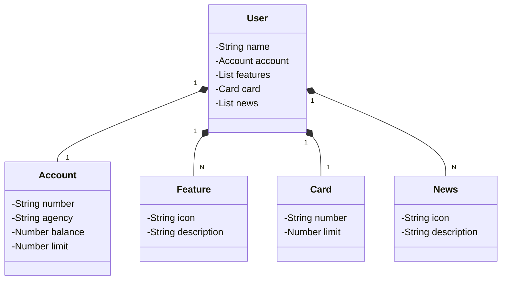

# Santander Backend 2024
        
# DIAGRAMA DE CLASSES 

```mermaid
classDiagram
    class User {
        -String name
        -Account account
        -List<Feature> features
        -Card card
        -List<News> news
    }

    class Account {
        -String number
        -String agency
        -Number balance
        -Number limit
    }

    class Feature {
        -String icon
        -String description
    }

    class Card {
        -String number
        -Number limit
    }

    class News {
        -String icon
        -String description
    }

    User "1" *-- "1" Account
    User "1" *-- "N" Feature
    User "1" *-- "1" Card
    User "1" *-- "N" News
```
